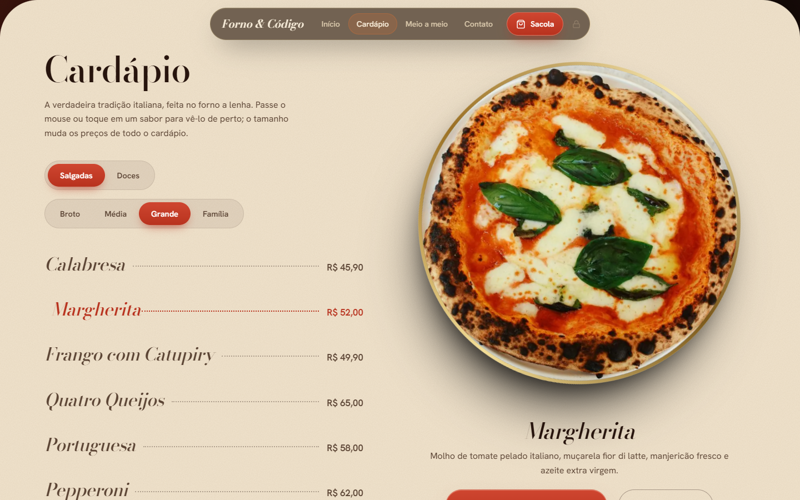
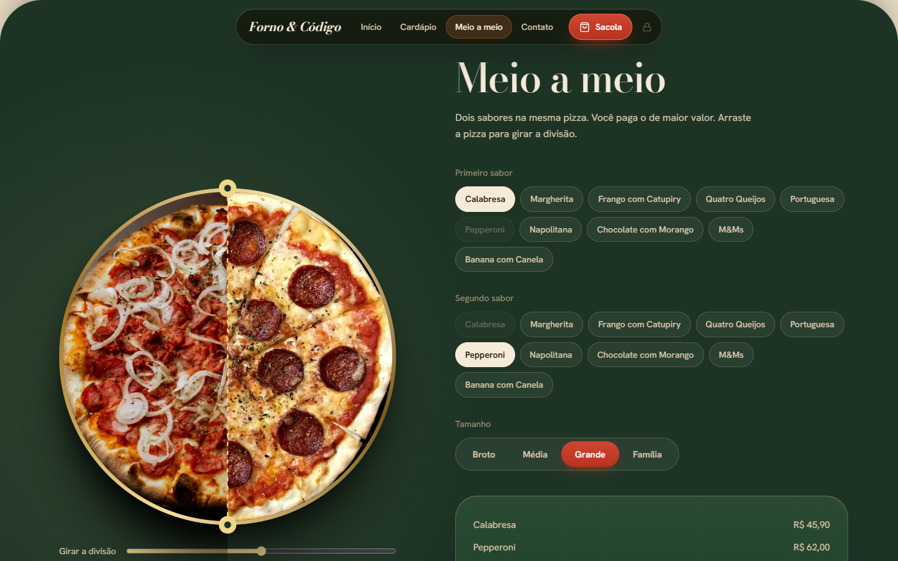
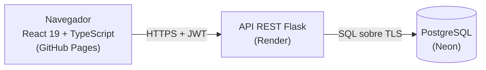

# Forno & Código

Plataforma de pedidos de uma pizzaria artesanal, no ar de ponta a ponta: cardápio dinâmico, pizza **meio a meio**, sacola e checkout, e um painel administrativo para cadastrar produtos e acompanhar os pedidos que chegam.

**Demo ao vivo:** https://gabriel-nux.github.io/Forno-e-C-digo/

> O código-fonte completo é privado. Este repositório mostra o resultado e **trechos escolhidos** (em [`amostras/`](amostras)) das partes de que mais me orgulho. Se você está avaliando meu trabalho e quer ver mais, é só pedir: berlofaspike@gmail.com.

| Cardápio | Meio a meio |
|---|---|
|  |  |

## Como é por dentro

- **Front-end:** React 19, TypeScript estrito, Tailwind v4, Vite, Motion (animações com física de mola), Zustand, TanStack Query, Zod e Radix. Organizado em Feature-Sliced Design, com a regra de dependência entre camadas verificada por lint (Steiger) no CI. HTML pré-renderizado no build.
- **Back-end:** Flask em camadas (rotas, esquemas Pydantic, serviços, repositórios), JWT, bcrypt, SQL parametrizado e migrações SQL versionadas.
- **Banco:** PostgreSQL com integridade nas regras (`CHECK`, chaves compostas, preço guardado em centavos inteiros).
- **Deploy:** Pages (front), Render (API) e Neon (banco).

## Decisões que valem a conversa

- **O servidor é a fonte da verdade do preço.** O pedido só aceita sabores, tamanhos, quantidades e contato. Campo extra é recusado, e o total é recalculado e gravado na mesma transação, com uma cópia do nome e do preço da hora da compra. → [`precificacao.py`](amostras/back-end/precificacao.py)
- **Meio a meio como regra pura.** Cobra o sabor mais caro, em centavos inteiros, e o estado do montador impede os dois sabores de serem iguais em qualquer sequência de ações (testado com 200 ações em sequência). → [`meio-a-meio.ts`](amostras/front-end/meio-a-meio.ts)
- **Limite de tentativas no banco, sem guardar dado pessoal.** O login bloqueia depois de 5 falhas por par IP + e-mail, para ninguém trancar o dono fora da própria conta, e a chave é um HMAC, então nem e-mail nem IP ficam em claro. → [`limite_de_tentativas.py`](amostras/back-end/limite_de_tentativas.py)
- **Modelagem que defende o dado.** Preço por produto e tamanho com chave composta, itens de pedido com `CHECK` para o meio a meio ter dois sabores diferentes. → [`0001_schema_inicial.sql`](amostras/banco/0001_schema_inicial.sql)
- **Sessão do painel só em memória.** O token nunca vai para o `localStorage`.
- **CI que testa de verdade.** Testes de integração em PostgreSQL real, migrações aplicadas do zero duas vezes (idempotência) e o servidor de produção sobe e responde. → [`testes.yml`](amostras/ci/testes.yml)

## Números (medidos em 2026-10-04)

- 458 testes automatizados: 171 no back-end (152 de unidade e 19 de integração com PostgreSQL real) e 287 no front-end.
- Lighthouse na URL pública: 98 a 100 no celular e 100 no desktop; acessibilidade 100, e o `axe-core` não achou violações.

## O que é real e o que falta

- **Funciona:** cardápio pela API, meio a meio, sacola, checkout, login do administrador, CRUD de produtos com preço por tamanho, lista de pedidos.
- **Ainda não existe:** pagamento online (o pedido nasce `pendente`) e mudar o status do pedido pelo painel.
- A API roda no plano gratuito do Render: depois de um tempo parada, a primeira carga pode levar cerca de 50 segundos.
- As fotos são de demonstração.

Licença: todos os direitos reservados. Veja [`LICENSE`](LICENSE).
